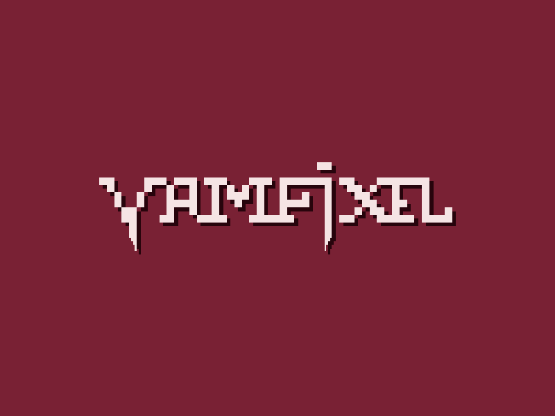

# VamPixel

Game developed for web with phaser framework in the Graduate studies course in electronic game development at the University of the State of Amazonas - UEA.

You can't resist your thirst for blood, can you?

## Team

### Team Developers

####  [Fernando Dantas](https://github.com/fernandodantasfilho)
####  [Paulo Matos](https://github.com/jrmatos)
####  [Jeferson Barros](https://github.com/jbalves)
####  [Irlan Gomes](https://github.com/irlancarlo)
####  [Cláudio Sampaio](https://github.com/csampaio)
  
### Team Designers

  * Josué Aguiar
  * Renan Zuany

## Game 

### Controls

[Play it](https://fernandodantasfilho.github.io/vampixel_platform/)

MIT Licensed
